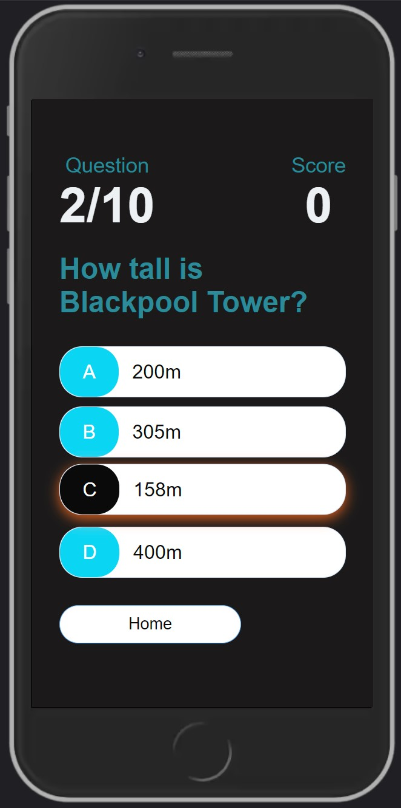
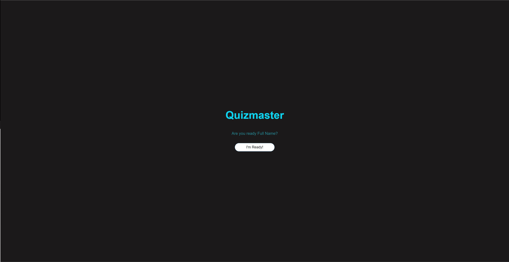
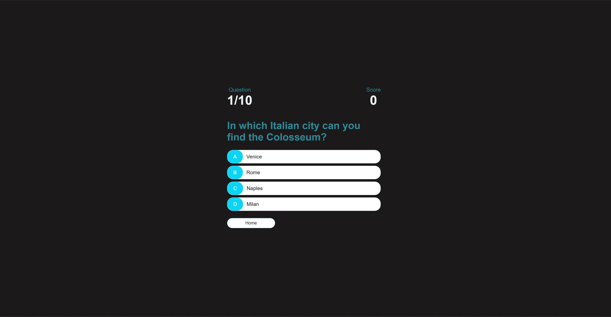
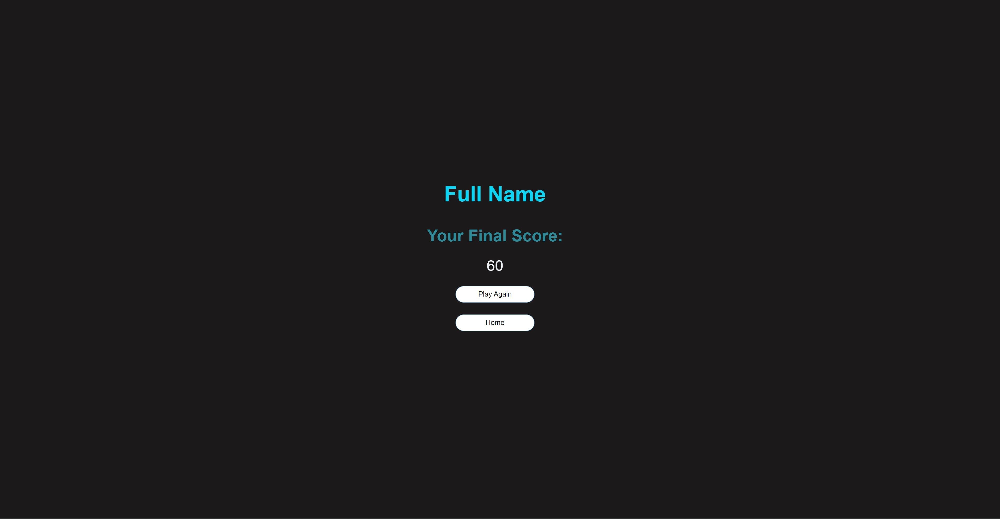

# Quizmaster

## Goals and objectives

Welcome to Quizmaster, an online quiz that allows the user to select from several categories and test their general knowledge on their chosen subject. With each correct answer selected, the user gains additional points in a score system included in my quiz so that they can clearly see how knowledgeable they are and compare previous results so that they can improve and gain further insight into their specific category. 

## Table of Contents

* [**UX**](#ux)
* [**User Goals**](#user-goals)
* [**User Stories**](#user-stories)
* [**Site owners objectives**](#site-owners-objectives)
* [**Requirements**](#requirements)
* [**Expectations**](#expectations)
* [**Design Choices**](#design-choices)
    + [Fonts](#fonts)
    + [Icons](#icons)
    + [Colours](#colours)
    + [Structure](#structure)
* [**Features**](#features)
    + [Existing Features](#existing-features)
      - [Headers](#headers)
      - [Responsive design](#responsive-design)
* [**Pages**](#pages)
    + [Home page](#home-page)
    + [Welcome page](#welcome-page)
    + [Quiz page](#quiz-page)
    + [End page](#end-page)
* [**Technologies Used**](#technologies-used)
    + [Languages](#languages)
    + [Tools](#tools)
* [**Testing**](#testing)
* [**Deployment**](#deployment)
* [**Credits**](#credits)

## UX

### User Goals

* Visually and aesthetically appealing and professional to the user
* Make sure the site is easily navigational with a clear structure and 
* Ensure there is a scoring system that increases with each correct answer given by the user

### User Stories
* As a user, I want to be able to enter my own personal username to participate in the quiz.
* As a user, I want the option to pick from different categories of quizzes
* As a user, I want to see my score progress
* As a user, I want to be able to exit out 
* As a user, I want to be able to pick an answer from four different options

### Site owner's goals

* Make sure that the user enters their name before starting the quiz
* Make sure that the site is easy to navigate for the user 
* Create a visually appealing site through the choice of appropriate colours, layout and structure
* Give feedback to the user on how they performed through the use of a scoring system

### Requirements

* Ensure the site is responsive and maintains structural integrity on mobile phones
* Use single-page layout.
* Give a positive user experience through colours and layout.
* Give feedback based on performance.

### Expectations

* I expect to know that this is my game based on my username.
* I expect that all the category choices present the correct type of questions
* I expect to be able to leave the question page and navigate back to the homepage if I wish
* I expect feedback on performance.
* I expect the scoring system to work as intended, adding scores appropriately whenever the correct option is picked
* I expect screen size not to affect the quality of my experience.

## Design Choices

### Fonts

The font style that I have decided to go with is Arial, Helvetica, sans-serif as it is a professional lookinf font ans is both appropriate for my project and clear to read. As opposed to my first project, I have decided to go with one particular font, as it contains less textual content and does not require two different font styles.

### Colours

The colour scheme that I have decided to go with for my second javascript project 

### Structure

The structure of my quiz site will be very simple and straightforward. There will be a landing page which will provide the user with the option to enter their name and click "submit" before being directed to the initialisation page. This page will contain a personalised message which asks them if they are ready to start the quiz, with a button at the bottom that starts the game once clicked by the user.

The reason why I have decided to go with this structure is because it is both simple and effective in achieving it's intended result. It allows the user to enter their personal details, which is stored in local storage using javascript in order for that name to be accessed on the final end screen for it to be displayed along with their final score.

## Features

## Existing Features

### Headers

I have ensured that the different headers used throughout my app have a level of consistency in aspects such as font-size, weight and colour. The main title of my app, for example, is the largest font as its a h1 header. Furthermore, all of the colours I have used for each of my different headers had to be selected carefully so that they are easy and clear to read by the user. This means that the colours selected had to contrast with the chosen colour of my background. 

## Responsive design

In order to make my game seem more responsive, I had to chnage certain elements within my site in order for it to be clear and presentable to the user depending on the device they are viewing it on. For example, I encountered an issue on the quiz page where as the screen would get smaller, all of the option buttons would become more cramped and the question itself would be partially hidden at the top. I managed to rectify this by adding some additional margin and padding properties using media queries. Additionally, I had to decrease the font-size of the question text in order for it to better fit on smaller screens and be presented in an organised way. The results can be seen below:

### Max width:600px

I decided that the break off point would be 600 pixels, as that is the mark where my app would start to lose some of it's structural integrity with headers not being displayed clearly and buttons becoming too cramped. I used maximum width so I decreased the sizes of the main text and adjusted some margin properties of buttons and the HUD.

## Pages

### Home page

The image above shows the landing page of my site that will be presented to users once they enter it's url. The structure of the page is both clear and simple, as all it requires from them is to enter their name within the text input field and click the submit button. The main title or the name of my quiz needs to be front and center on this page as well as be suitably styled to catch the users' attention. I believe that my main heading does exactly that.

### Welcome page

This page is the welcome section of my quiz app. It contains a personalised message invidual to every user based on the name which they have previously entered. This name is stored using local storage for it to be accessed on the end screen after they complete the quiz, and is also displayed using template literals on this particular page.

It prepares the user for the quiz they are about to begin by asking if they are ready, along with a button at the bottom of the message that starts the game. The reason why I have decided to include this page is to both store their name for it to be shown along with their final score on the end screen, as well as give my app a more personal touch to the user.

### Quiz page

This is the quiz section of my site. Once the user clicks on the button on the welcome page to start the game they are shown this page. The overall structure of my quiz page remains consistent throughout regardless of which question the user is currently on. This was very important as my site needed to have that level of consistency as there are two counters displayed at the top of each page, as can be seen in the image above. As the user moves through the different questions, the question counter dynamically updates to show and inform the user which question they are currently on out of a total number of questions they need to answer before they complete the game. This gives a clear picture of the players' progress and how long they have left before they finish the game.

My quiz page also includes a score counter which also dynamically increases with each correct answer the user selects by 10 points each. Both the question and the score counter are styled in a way that is both clear and bold, as they are important features needed for my app's interactivity. The score counter was included in order to give my app an element of competitiveness so as to make the user want to take the quiz multiple times in order to try and get a better score from their last attempt.

I have also decided to include a home button at the bottom of the choice containers which takes the player back to the homepage, so that if the user decides to quit the game, they have that option available to them rather than having to finish the entire quiz first.

### End page

This is the end screen for my game. THis is displayed automatically once the user completes the last question of my game. As the image above shows, it displays the name of the user that they entered on the homepage, as well as their final score in a clear, well illustrated way. The structure of this page is both clear and aesthetically plewasing to the eye formatted in a column-like way. 

After their final score is displayed on screen, it provides the user with the option to either restart the game with their name still stored within local storage, or to navigate back to the landing page where they must either re-enter their details again or enter a different name if someone else wants to play the game.

## Technologies Used

### Languages

* Html
* Css
* Javascript

### Tools

* Construction and deployment- Gitpod
* HTML validation- W3C HTML Validation Service
* CSS validation- W3C CSS Validation Service
* JS syntax validator- Esprima
* Spell check- Grammarly

## Testing

It was important right from the get go that my site was kept simple and clear for the user when it comes to the styling and structure of my app. As it is essentially a game that they are playing, my app needed to be accessible to the largest target audience as possible and formatted in a way that makes it easy for anyone to jump right in and start taking the quiz without any confusion. I believe that the overall layout of my site manages to accomplish this, something which is reinforced by the lighthouse results my site achieved shown in the image above. 

There were, however, certain issues that I ran into throughout the course of development that needed to be overcome. The first question that I had to ask myself was the file structure of my project, and whether or not I was going to create more than one file for the html, css and javascript elements of my site. I decided to use more than one, as I believe it organised all of the different code used throughout my project in a way that is both clear to read as well as easy to make changes to. 

As this was the first time I have ever used javascript, it was a big learning experience for me where I had to utilise both the resources offered by Code Institute, as well as other external resources from different websites and video tutorials. The biggest issue that I encountered using javascript is the score counter. WHen I first started on my quiz app, it did not have a timeout function my final version does now. Instead, I had a button which once clicked upon would direct the user to the next question after they select their answer. The reason why I decided to use a timeout method instead is because I believe it makes it more convenient for the user to automatically be redirected to the next question without any input.

The score counter was a big problem that I encountered while making this site. ALthough incrementing the score and having it dynamically add a specific amount was not too much of an issue, getting it to ignore further clicks from the user was something that I had to figure out.

Updating the question counter was also a bit of an issue as I needed to show both the question that the user was on as well as the maximum number of questions that the quiz contained. I did this by using template literals, and incrementing the counter each time the user answered a question and having a set number of maximum questions. The code I used can be seen below:

const maxQuestions = 10;

questionCounter++

questionCounterText.innerText = `${questionCounter}/${maxQuestions}`

I also had a few problems regarding generating random questions out of the 20 that I had included within my json file. The reason as to why it was important for me to do this is so that if the user decided they wanted to have another go at the game, they will then be presented with either completely different questions, or the same ones but in a different order so as not to make their second or third try too easy. The way that I managed to make this happen is with the following code:

const questionIndex = Math.floor(Math.random() * availableQuestions.length)
    currentQuestion = availableQuestions[questionIndex]
    question.innerText = currentQuestion.question

This takes a random number from my questions array and displays it as the current question that the user is on.

## Deployment

Once the code was written, committed and pushed to GitHub, this project was deployed using GitHub following these steps:

* Navigate to the repository on GitHub and click 'Settings'.
* Select the 'Pages' option on the sidebar.
* Select the 'None' dropdown, and then click 'master'.
* Click on the 'Save' button.
* The website is now live https://shaf8808.github.io/quizmaster/
* If any changes are required, they can be made, committed and pushed to GitHub and the changes will be updated automatically.

## Credits 
For question examples:
* https://www.quiztriviagames.com/multiple-choice-trivia-questions/
* https://www.cambridge-news.co.uk/whats-on/10-general-knowledge-quiz-questions-23406003

For coding help:
* Simen Daehlin
* James Q Quick
* Stack Overflow
* Sam Timmins